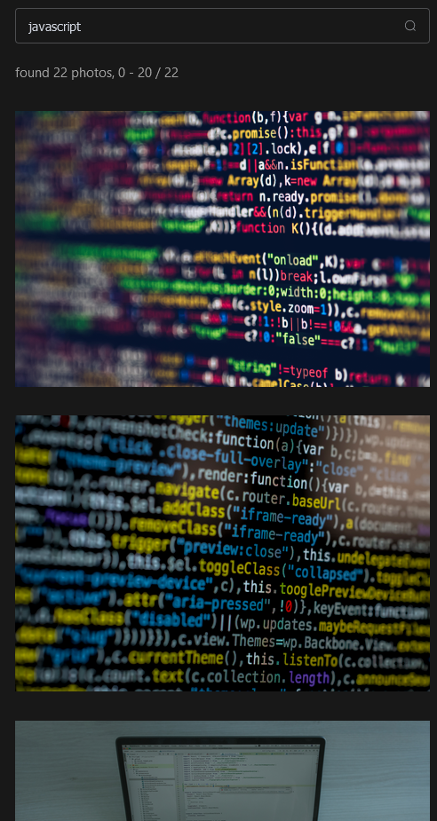
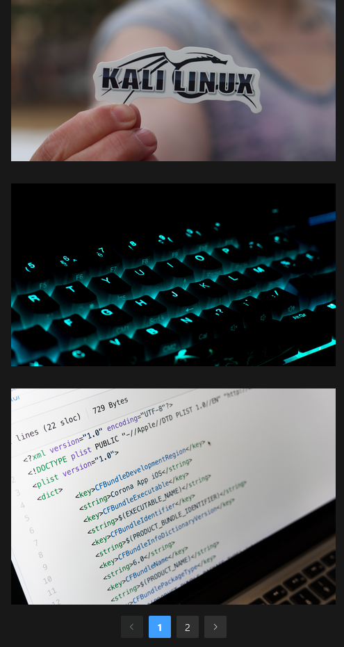

# Pixel Gallery

This is a web application that displays a collection of images from the Pexels API. The app is built using Vue.js 3,
Vuex, Element Plus, and Axios.

## Features

* Displays a collection of images from the Pexels API
* Allows users to search for images by keyword
* Includes pagination to display images in batches of 20
* Displays a loader while images are being loaded from the API

## Getting Started

1. Clone this repository to your local machine.
2. Install the dependencies by running `npm install`.
3. Change Pexels api key from line 45 of `sec/store/index.js`.
4. Run the development server with `npm dev`.
5. Open your browser and navigate to `http://localhost:5173`.

## Technologies Used

* Vue.js 3
* Vuex
* Element Plus
* Axios

## API Used

This project uses the Pexels API to fetch images. You can find more information about the
API [here](https://www.pexels.com):

## Acknowledgments

* This project was inspired by the many beautiful image gallery websites out there.
* Thank you to Pexels for providing the free API that made this project possible.

## Screenshots

